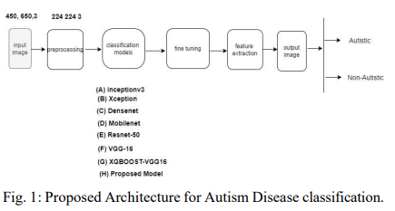
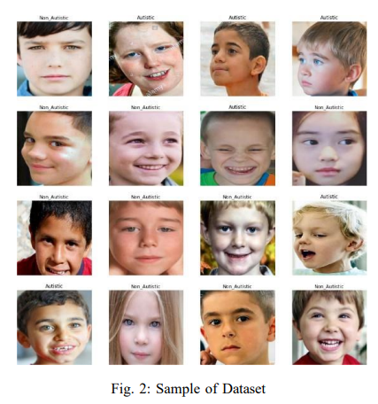

# Autism-disease-detction

dataset can be found here: https://drive.google.com/drive/folders/1kFSl8acOOQLJwG3v9Sdx2Q-TKpkA_U8b?usp=drive_link

**Autism Disease Detection Using Transfer Learning Techniques: Performance Comparison Between Central Processing Unit vs Graphics Processing Unit Functions for Neural Networks**

**Abstract**

Neural network approaches are machine learning 
methods that are widely used in various domains, such as 
healthcare and cybersecurity. Neural networks are especially 
renowned for their ability to deal with image datasets. During the 
training process with images, various fundamental mathematical 
operations are performed in the neural network. These operations 
include several algebraic and mathematical functions, such as 
derivatives, convolutions, and matrix inversions and transpositions. Such operations demand higher processing power than what 
is typically required for regular computer usage. Since CPUs 
are built with serial processing, they are not appropriate for 
handling large image datasets. On the other hand, GPUs have 
parallel processing capabilities and can provide higher speed.
This paper utilizes advanced neural network techniques, such as 
VGG16, Resnet50, Densenet, Inceptionv3, Xception, Mobilenet, 
XGBOOST-VGG16, and our proposed models, to compare CPU 
and GPU resources. We implemented a system for classifying 
Autism disease using face images of autistic and non-autistic 
children to compare performance during testing. We used evaluation matrices such as Accuracy, F1 score, Precision, Recall, and 
Execution time. It was observed that GPU outperformed CPU 
in all tests conducted. Moreover, the performance of the neural 
network models in terms of accuracy increased on GPU compared 
to CPU

**Architecture**

 
  

**Paper Link**
https://ieeexplore.ieee.org/abstract/document/10196924?casa_token=DHISLDLb32gAAAAA:kCcnC6OfKCtR_gTmC1uaY-AN2DZtGIZJDPE8FROe7BAfvuBWK15PsPQMenNwBKLOj303uRl6Pv0

**PDF Copy**
https://arxiv.org/ftp/arxiv/papers/2306/2306.00283.pdf

**My Google scholar**
https://scholar.google.com/citations?view_op=list_works&hl=en&hl=en&user=PHg000cAAAAJ

  **Cite Work**

  Bibtex:  
  
  @inproceedings{akter2023autism,
  title={Autism Disease Detection Using Transfer Learning Techniques: Performance Comparison Between Central Processing Unit vs Graphics Processing Unit Functions for Neural Networks},
  author={Akter, Shapna and Shahriar, Hossain and Cuzzocrea, Alfredo},
  booktitle={2023 IEEE 47th Annual Computers, Software, and Applications Conference (COMPSAC)},
  pages={1084--1092},
  year={2023},
  organization={IEEE}
}

**MLA:**

Akter, Shapna, Hossain Shahriar, and Alfredo Cuzzocrea. "Autism Disease Detection Using Transfer Learning Techniques: Performance Comparison Between Central Processing Unit vs Graphics Processing Unit Functions for Neural Networks." 2023 IEEE 47th Annual Computers, Software, and Applications Conference (COMPSAC). IEEE, 2023.

**APA:**

Akter, S., Shahriar, H., & Cuzzocrea, A. (2023, June). Autism Disease Detection Using Transfer Learning Techniques: Performance Comparison Between Central Processing Unit vs Graphics Processing Unit Functions for Neural Networks. In 2023 IEEE 47th Annual Computers, Software, and Applications Conference (COMPSAC) (pp. 1084-1092). IEEE.

